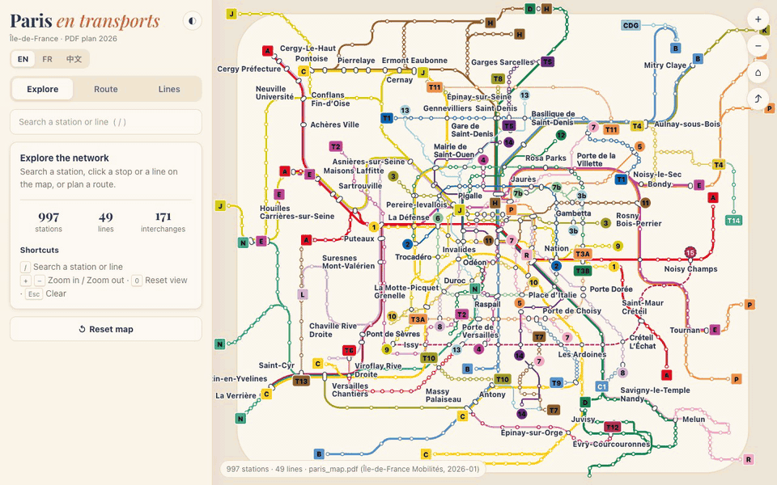

# Paris Map Vibe

Interactive Île-de-France transit map (Métro, RER, Transilien, Tram, Câble,
CDGVAL/Orlyval) built with D3.js from the official IDFM PDF plan
(`resources/paris_map.pdf`, January 2026 edition).

- Route geometry, stop positions, stop lists and station names are extracted
  from the PDF vectors, then reconciled with the MySQL database.
- Station search (accent-insensitive), line focus, station details with
  neighbouring stops and walking connections.
- Itinerary planner (fastest / fewer transfers, optional "metro & tram only"),
  drawn along the real line geometry.
- Line-number badges on the map (at termini and along the lines), Métro 15
  (16 stations) and CDG Express (Gare de l’Est ↔ CDG 2), both under
  construction and drawn dashed.
- Works offline after the first visit: `public/sw.js` (Service Worker) keeps
  the page, fonts and map data in the browser; online visits still fetch
  fresh data first.
- English / Français / 中文 interface: English by default, switcher in the
  header, remembered per browser, `?lang=fr|zh` in links.
- Shareable URLs (`#station=…`, `#line=…`, `#route=from-to`), keyboard
  shortcuts (`/`, `+`, `-`, `0`, `Esc`), dark mode, mobile bottom-sheet
  layout, optional layer of lines under construction.

## Demo

Live: https://map.xyufr.com

<p align="center">
  
</p>

The demo shows, in order: the full network drawn from the PDF → zooming into
central Paris → searching *Porte de Vanves* (map pin and zoom) → focusing
Métro 14 with its ordered stations → planning La Défense → Bastille (fastest
and fewer-transfers options) → switching the interface to 中文 / Français →
dark mode → *Reset map*.

## Run locally (MySQL)

```sh
python3 server.py
```

Open http://127.0.0.1:8000/. `/api/map` is built live from MySQL
(see `AGENTS.md` for the database configuration).

## Deploy to Cloudflare Workers

The Worker serves `public/` as static assets and answers `/api/map` from the
pre-built `public/data/map.json`, so no database is needed in production.

```sh
python3 resources/export_static.py   # refresh public/data/map.json from MySQL
npm install
npx wrangler dev                     # local preview on http://localhost:8787
npx wrangler deploy
```

Configuration: `wrangler.jsonc` and `src/worker.js`.

## Data pipeline (PDF → MySQL)

```sh
python3 resources/pdf_network.py        # PDF strokes, stop markers, words
python3 resources/pdf_labels.py         # station label blocks
python3 resources/build_network.py      # route geometry + stops per line
python3 resources/resolve_network.py    # stop clusters + label assignment
python3 resources/reconcile_network.py  # match stops to DB stations (report in resources/build/)
python3 resources/apply_network.py --dry-run
python3 resources/apply_network.py      # back up the tables first
python3 resources/add_line15.py         # Métro 15 (line.status = construction)
python3 resources/add_cdg_express.py    # CDG Express (line.status = construction)
python3 resources/export_static.py
```

Manual decisions verified against PDF crops live in
`resources/network_overrides.json`; dashed (under construction) routes are in
`resources/future_lines.json`.
